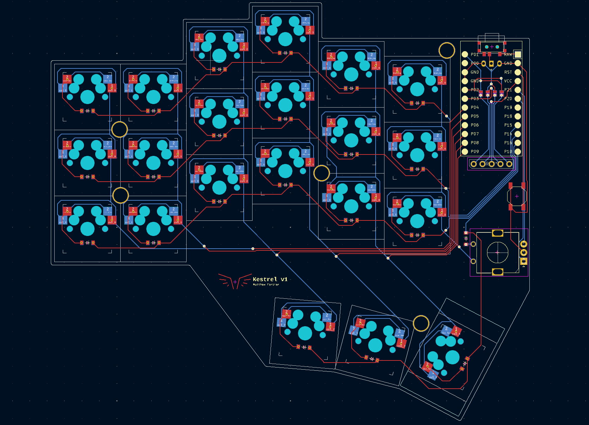
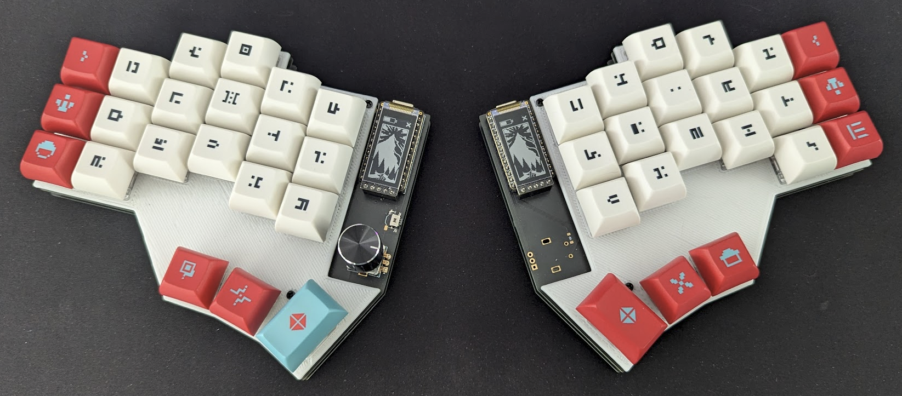
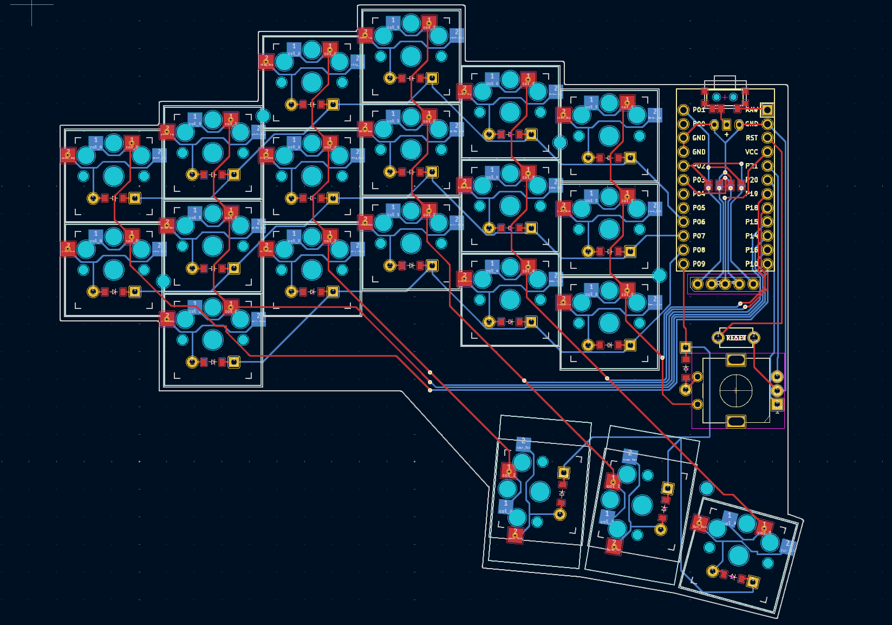
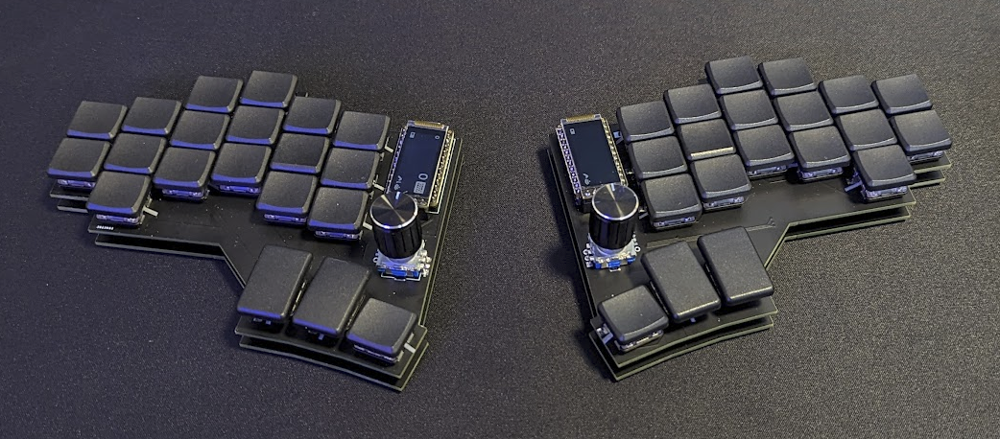

# ZMK-Shields

This project contains the design and firmware files for custom wireless split ergonomic keyboards I have designed.

## Repository Structure

- **kicad/**: Contains all KiCad design files, including:
  - Reversible PCB designs
  - Top and bottom plate designs for most shields

- **boards/**: Contains the ZMK firmware plugin files.

## Getting Started

### KiCad Design Files

The `kicad` directory includes all necessary files to modify and fabricate the keyboard's PCB and plates. Open these files in KiCad to view or edit the design.

### Firmware

The firmware for the keyboard is managed using ZMK, a flexible firmware specifically designed for custom keyboards. The firmware compilation is handled using Zephyr and automated through GitHub Actions. Simply push a commit and GHA will produce the files which can be flashed as per [ZMK's flashing instructions](https://zmk.dev/docs/development/build-flash).

## Keyboard Designs

### Kestrel

The Kestrel (V1) is an ortholinear wireless split keyboard with 21 keys + rotary encoder per side.

### Nightingale

The Nightingale is an ortholinear wireless split keyboard with 20 keys + rotary encoder per side. It uses low-profile choc switches and is designed to be portable with an extensive battery life.

